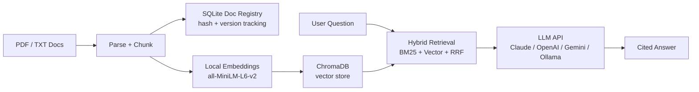

# Legal & HR Document Assistant (RAG)


> Answers legal and HR compliance questions from a library of source documents, with every claim tied to a citation (filename, page, version) -- and no number rewritten to "look right" if it disagrees with the LLM's training data.

## The Problem

Staff answering employment-law and compliance questions -- OSHA safety obligations, FLSA wage rules, EEOC guidance, workplace policy -- have to dig through hundreds of pages of federal handbooks and fact sheets to find the right answer with the right citation. Manual search is slow, and paraphrasing a compliance figure from memory risks getting it wrong. A generic chatbot has the opposite problem: asked about an unusual or non-round number, it will often "correct" the document's actual value back toward whatever looks typical from its training data -- exactly the kind of error that matters most in a compliance context.

## The Solution

A retrieval-augmented generation pipeline: source PDFs are parsed, chunked, embedded locally, and indexed. A query runs hybrid retrieval (BM25 keyword search + vector similarity, combined with Reciprocal Rank Fusion) so both exact terms (regulation numbers, dollar figures) and semantically related phrasing get surfaced. The LLM then answers strictly from the retrieved chunks, with a system prompt that requires a citation on every factual claim and explicitly instructs it to copy numbers verbatim from the context rather than reconciling them against its own knowledge.

A SQLite document registry tracks each source file by content hash, so re-ingesting only processes documents that actually changed, and every retrieved chunk carries a version number -- if a regulation gets updated, old citations don't silently keep pointing at superseded text.

## Data Handling

Embeddings and retrieval always run locally (sentence-transformers + ChromaDB on-disk) -- documents never leave the machine for the indexing step. The answer-generation step is different: retrieved passages ARE sent to whichever LLM provider is selected, if it's a hosted API (Claude, OpenAI, Gemini). Selecting the Ollama provider keeps the entire pipeline, including generation, fully local with no data leaving the machine. Choose the provider per query based on the sensitivity of the documents involved.

## Architecture



## Stack

- Python 3.10+
- sentence-transformers (`all-MiniLM-L6-v2`) -- local embeddings
- ChromaDB -- local persistent vector store
- rank-bm25 -- keyword search half of hybrid retrieval
- pdfplumber -- PDF text extraction
- SQLite -- document registry (content hash, version, ingested_at)
- FastAPI + Streamlit -- API and demo UI
- Claude, OpenAI, Gemini, or Ollama -- swappable LLM backend for answer generation

## How to Run

### Docker

```bash
git clone https://github.com/emberlytic/rag-document-assistant.git
cd rag-document-assistant
cp .env.example .env
# edit .env -- set at least one provider API key, or leave only Ollama configured

docker compose up --build
# API:  http://localhost:8000
# UI:   http://localhost:8501
```

Ingested data (ChromaDB + the SQLite registry) persists in a named volume across restarts. This is the same code path as the manual setup below -- containerization doesn't change behavior, just how it's run.

### Manual (venv)

**1. Clone and install**
```bash
git clone https://github.com/emberlytic/rag-document-assistant.git
cd rag-document-assistant
python -m venv venv
source venv/bin/activate
pip install -r requirements.txt
```

**2. Configure your API key**
```bash
cp .env.example .env
# Edit .env -- set at least one of ANTHROPIC_API_KEY / OPENAI_API_KEY / GOOGLE_API_KEY,
# or point OLLAMA_BASE_URL at a local Ollama instance for a fully local setup
```

**3. Fetch source documents**

Sample data isn't checked into the repo. Each demo has a fetch script that pulls public documents:
```bash
python scripts/fetch_legal.py   # OSHA / DOL / EEOC / FTC / SBA guidance (this demo)
python scripts/fetch_pubmed.py  # medical research demo
python scripts/fetch_docs.py    # FastAPI documentation demo
```

**4. Start the API and UI**
```bash
./start.sh
# API:  http://localhost:8000
# UI:   http://localhost:8501
```

**5. Ingest and query**

Via the Streamlit UI (http://localhost:8501), or directly against the API:
```bash
curl -X POST localhost:8000/ingest -H "Content-Type: application/json" -d '{"demo": "legal"}'

curl -X POST localhost:8000/query -H "Content-Type: application/json" \
  -d '{"demo": "legal", "question": "What are the OSHA hazard communication requirements for chemicals?"}'
```

**Sample response** (`provider` in the request defaults to `LLM_BACKEND` in `.env`; pass `"provider": "claude"` etc. to override per query. If the requested provider fails or its circuit breaker is open, the request transparently falls back to the next configured provider -- `attempts` shows what was tried):
```json
{
  "answer": "## Employer Requirements for Chemical Hazard Communication\n\n**Chemical Inventory & Labeling:** Keep a current list of hazardous chemicals in the workplace and ensure containers are properly labeled with hazard warnings [Source: osha_employer_responsibilities_handbook.pdf | Page 11 | Version 1].\n\n**Safety Data Sheets:** Make Safety Data Sheets available to workers, readily accessible without leaving their work area [Source: osha_hazard_communication.pdf | Page 7 | Version 1].\n\n**Governing Standard:** These requirements fall under 29 CFR 1910.1200, aligned with the UN Globally Harmonized System (GHS) [Source: osha_hazard_communication.pdf | Page 7 | Version 1].",
  "provider": "claude",
  "attempts": ["claude:ok"],
  "sources": [
    {"text": "...", "source": "osha_hazard_communication.pdf", "page": 7, "version": 1, "score": 1.0}
  ]
}
```

## API Endpoints

| Endpoint | Method | Description |
|---|---|---|
| `/health` | GET | Lists configured demos |
| `/ingest` | POST | `{"demo": "legal"}` -- ingest all files in that demo's `data_dir`, skipping unchanged ones |
| `/sync` | POST | Re-runs the demo's fetch script, then ingests -- picks up updated source documents |
| `/query` | POST | `{"demo", "question", "top_k", "provider"}` -- returns a cited answer and its source chunks |
| `/documents/{demo}` | GET | Lists ingested documents with version and status |
| `/metrics` | GET | Prometheus-format request counts, latency, and per-provider circuit breaker state |

## Included Demos

This repo ships three pre-configured demos, selectable by `demo` name (`demos/registry.py`):

- **`legal`** -- Legal & HR compliance assistant over OSHA/DOL/EEOC/FTC/SBA public guidance (this README's focus)
- **`medical`** -- Medical research literature assistant over PubMed papers, with contradiction flagging across sources and explicit no-clinical-advice guardrails
- **`tech_support`** -- Technical documentation assistant over FastAPI's public docs

Each demo is a `DemoConfig` (`demos/__init__.py`) pairing a system prompt, a data directory, and a fetch script. Adapting to a new document set means writing a new `DemoConfig` and fetch script -- the retrieval and generation pipeline is shared.

## Testing

```bash
pip install -r requirements-dev.txt
pytest -v
```

Tests cover the document registry (versioning, change detection), chunking and PDF-cleanup logic, hybrid retrieval's ranking behavior, provider selection and prompt construction in the generator, and the demo registry -- all with the vector store and LLM API calls mocked, so no ChromaDB data, API key, or network access is needed. Note that importing `core.retriever` or `core.ingestion` still pulls in `chromadb` and `sentence-transformers` transitively (they're used elsewhere in those modules), so `requirements-dev.txt` installs the full dependency set even though the tests themselves don't call those services. CI runs the same suite on every push via GitHub Actions (`.github/workflows/tests.yml`).

## How This Maps to Production

This repo is a demo, and some pieces are intentionally scoped down. Here's what's demo-scope versus what a real deployment would need:

- **Containerization** -- `Dockerfile` and `docker-compose.yml` are the real deployment unit here, not a demo prop. What's missing for a production cluster: an orchestrator (Kubernetes/ECS) for multi-instance scaling, and a managed Postgres/Chroma-Cloud-style vector store instead of the on-disk SQLite/ChromaDB pairing, which assumes a single instance with persistent local storage.
- **Secrets** -- `core/secrets.py` defines a `SecretsProvider` interface so the app doesn't call `os.getenv()` directly. The demo backs it with plain environment variables (`EnvSecretsProvider`). A real deployment would back it with a real secrets manager (AWS Secrets Manager, Vault) -- `CloudSecretsProvider` is a stub marking that swap point, not a working integration, because there's no cloud infrastructure here to integrate with honestly.
- **Provider fallback** -- `core/resilience.py` implements a real per-provider circuit breaker (closed/open/half-open with a failure threshold and cooldown), and `core/generator.py` uses it to fail over to the next configured provider on error. This is genuine failover logic, not a mock. What's demo-scope: breaker state is in-process and resets on restart. A multi-worker production deployment would need that state shared (e.g. Redis) so all workers agree on which providers are healthy.
- **Observability** -- `/metrics` returns real Prometheus-format counters and a real circuit-breaker gauge, and every query logs a structured JSON line. What's missing: this repo doesn't ship a Prometheus server or Grafana dashboard to consume it -- wiring up the metrics endpoint to actual monitoring infrastructure is left as the next step, since standing up and maintaining that infrastructure isn't demonstrable in a single-repo portfolio project.

## Case Study

See [case-study.md](./case-study.md) for the full scenario walkthrough.

---

> Client names and identifying details in this case study are fictional.
> The problem structure, workflow logic, and solution approach are based on real-world patterns from actual engagements.
